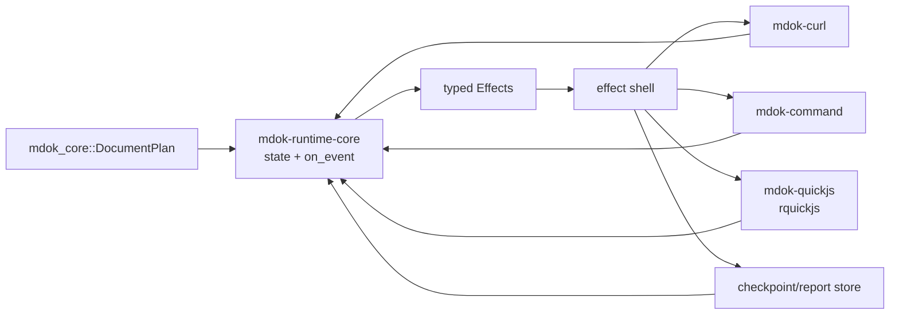

# Celld pattern for MDOK with QuickJS

Status: design note. The Celld source is vendored as reference material at
`vendor/celld`, pinned to commit `553ae73f83c87c3f7c7a5f73c32c2211d9d7341f`
(`v0.1.0`). It is deliberately not a member of the MDOK Cargo workspace. Its
V8 dependency must remain inside the reference checkout and must not become an
MDOK runtime dependency.

The QuickJS reference is the Terrane capability at
`/Users/vehasuwat/Project/terrane/rust/crates/terrane-cap-js-runtime` (the
older `../ternane/rust/crate/cap-quickjs` spelling is not present in this
workspace). It uses `rquickjs` and is the engine boundary to reuse; MDOK should
not copy Celld's V8 boundary.

## What is worth taking from Celld

`vendor/celld/crates/logic` is a replayable decision core. Its `on_event`
function is the only state transition entry point, and it returns typed
`Effect` values for the shell to perform. The core does not read clocks, do
I/O, spawn tasks, or access the JavaScript engine. The production executor and
a deterministic fake feed the same events back into the same core.

The important properties are:

- Every asynchronous operation has an operation ID. A completion for an old
  operation is ignored instead of mutating a newer phase.
- Wall and monotonic time are sampled by the shell and carried in events; the
  policy is still replayable.
- Lifecycle policy (admission, cancellation, deadlines, eviction, retries) is
  in the core. Adapters perform mechanics only.
- A write acknowledgement can be held behind an explicit durability gate.
  This is a gate for Celld's own replicated state; it is not proof that an
  arbitrary remote HTTP server persisted a request.
- Hibernation is an optimization. It is allowed only at a safe lifecycle
  boundary and must be recoverable from the durable state of record.
- Retry classification distinguishes “never reached the peer” from an
  ambiguous request that may already have run. Ambiguous HTTP work is not
  automatically retried.

The small pure modules are as valuable as the large state machine:
`logic/routing.rs` (retry classification), `logic/wake.rs` (ordered durable
timer reconciliation), and `logic/cache.rs` (cache-only eviction policy) are
good models for isolated MDOK policies with deterministic tests.

## Mapping the pattern to MDOK

| Celld | MDOK equivalent |
| --- | --- |
| Cell | One document/run execution session, identified by a stable `RunId` |
| Immutable deployment | `mdok_core::DocumentPlan` plus a content digest |
| Cell state | Current step, scoped variables/captures, summaries, pending operation, generation, and status |
| Event | A request/script/check/capture/checkpoint completion or an explicit timer/cancel event |
| Effect | Curl transfer, bounded exec, QuickJS hook, checkpoint, timer, report emission, or completion |
| Epoch | Run/plan generation; invalidates late completions after cancellation or reload |
| Hibernation | Stop at a step boundary after checkpointing; resume from the durable run snapshot |
| Durability gate | Acknowledgement of MDOK's own checkpoint/report, never an assertion about remote server durability |

The current repository has three representations that need to converge before
this becomes the canonical runtime: `mdok_core::DocumentPlan`, the duplicate
`mdok_runtime::DocumentPlan`, and the CLI-local plan/executor in
`crates/mdok-cli/src/main.rs`. Celld's pattern says to keep one immutable plan
model and put all mutable execution state behind one event/effect API.



## Proposed MDOK core

The first implementation should be local and single-process. It does not need
Celld's node leases, S3 compare-and-swap ownership, SQLite WAL replication, or
peer protocol.

`mdok-runtime-core` (or an equivalent module extracted from
`mdok-runtime`) should own a state such as:

```text
RunState {
  run_id,
  plan_digest,
  generation,
  phase,
  next_step,
  scoped_variables,
  step_summaries,
  pending_operation_and_deadline,
  status,
}
```

Its event vocabulary should be explicit and serializable. A minimal first
slice is:

```text
StartRun { run_id, plan_digest, now_mono_ms }
StepStarted { op, step }
TransferFinished { op, result }
ScriptFinished { op, phase, result }
ChecksEvaluated { op, result }
CapturesCommitted { op, values }
CheckpointWritten { op, result }
TimerFired { timer, now_mono_ms }
Cancel { run_id }
```

Corresponding effects are `ExecuteCurl`, `ExecuteExec`, `RunQuickJs`,
`WriteCheckpoint`, `ScheduleTimer`, `EmitStep`, and `CompleteRun`. Each effect
must carry the operation/generation that authorized it. The core, not the
adapter, decides whether a completion is still current.

The existing sequential guarantees remain the default: a capture is committed
only after its step's transfer and checks succeed. The event model makes that
guarantee durable and resumable rather than merely a property of one blocking
call stack.

## QuickJS boundary

The QuickJS adapter should follow Terrane's `sandbox.rs` shape while keeping
MDOK's capabilities narrower:

1. Create one `rquickjs::Runtime`/`Context` on a dedicated runtime worker. Keep
   QuickJS values on that worker; `rquickjs` values are context-bound and are
   not a cross-thread state representation.
2. Apply stack, heap, and interrupt budgets before evaluating a script. The
   interrupt callback must use an injected deadline/cancellation signal, not a
   hidden policy read from the event core.
3. Install a small host object (`mdok`, or a Postman-compatible `pm` facade)
   from a typed capability manifest. Expose request/response metadata, scoped
   variable reads/writes, captures, assertions, and bounded logging only.
4. Do not expose ambient filesystem, process, sockets, DNS, wall clock,
   randomness, or unrestricted host callbacks. A script that needs network
   work emits a typed effect (for example `pm.sendRequest` becomes a policy-
   checked child transfer) and resumes through an event.
5. Make dynamic code an explicit profile choice. A compatibility profile must
   provide `eval`/`Function` semantics when the target Postman profile allows
   them; a hardened profile may remove them, but then it must not claim full
   Postman compatibility. In either profile the generated code remains inside
   QuickJS with the same heap, stack, interrupt, and capability limits. Terrane
   demonstrates the hardened variant (removing `eval`/`Function`), strict
   argument conversion, first-error capture, and bounded JSON/resource
   conversion.
6. Treat secrets as tainted/opaque inputs. They may be supplied to an allowed
   request or script capability, but are never placed in event logs, reports,
   checkpoints, or exception text. Script output is size/depth limited before
   it reaches the core.
7. Keep JavaScript execution an effect. The core records the supplied script
   digest, phase, inputs, and bounded result; replay folds that result instead
   of silently re-running JavaScript.

The Postman importer can then lower supported `test` and `prerequest` scripts
to explicit QuickJS hook effects. Unsupported Postman APIs should remain
diagnostics until their capability semantics are defined; importing a script
must not silently grant it Node or browser authority.

## Postman compatibility is a host contract

“All Postman JavaScript” has two separate meanings:

1. **Language compatibility:** the ECMAScript source parses and behaves the
   same way. QuickJS covers much of ordinary JavaScript, but it is not Node.js
   and does not provide Node's module loader or built-in modules by itself.
2. **Postman compatibility:** the script observes the same `pm` objects,
   variable precedence, callbacks/promises, collection-runner events, request
   mutations, cookies, errors, limits, and control-flow behavior.

The second layer is the large one. The official Postman sandbox exposes
`pm.test`, `pm.info`, `pm.vault`, `pm.globals`, `pm.cookies`, `pm.execution`,
`pm.variables`, `pm.visualizer`, `pm.sendRequest`, environment/iteration/
collection variables, plus request/response-specific objects. The official
sandbox source also documents an event bridge (`execute`, abort, response,
cookie, request, result, and error events). That is a protocol to reproduce,
not a single JavaScript file to evaluate.

The collection runner adds another contract: iteration data, script/request
timeouts, delays, stop-on-error/failure modes, nested request limits, secret
resolution, cookie and redirect policy, proxies, TLS/network restrictions,
OAuth refresh, `pm.execution.runRequest`, `skipRequest`, and
`setNextRequest`. The official runtime has separate resolvers for referenced
requests and packages. A plain QuickJS `eval` cannot provide these semantics.

There is also no single universal Postman behavior target. For example,
`pm.execution.runRequest` has collection-runner-specific behavior and is not
supported by Newman, while `pm.vault` is unavailable in the Postman CLI and
Newman. MDOK must pin a compatibility profile (for example, “Postman CLI
profile vX”) rather than claim that every Postman host has identical APIs.

### Compatibility profiles

Define a versioned profile, stored with the imported collection and run:

```text
postman_profile = {
  api_version,
  supported_hooks: [prerequest, test],
  variable_scopes: [global, collection, environment, data, local],
  control_flow: [skip_request, set_next_request, run_request],
  nested_request_limit,
  script_timeout_ms,
  request_timeout_ms,
  package_policy,
  secret_policy,
  protocol_features,
}
```

Every API not in the profile must fail with a named compatibility diagnostic,
not silently return an empty object. This makes “unsupported” observable and
prevents a script from passing accidentally because a capability was missing.

### QuickJS implementation of the Postman surface

Implement the surface in layers, with the same effect protocol described
above:

- **ECMAScript layer:** QuickJS standard objects, Promise jobs, timers,
  `Date`, typed arrays, and bounded JSON conversion.
- **Postman object layer:** `pm.info`, `pm.request`, `pm.response`, `pm.test`,
  `pm.expect`, `pm.cookies`, and the five variable scopes. Keep scope values
  separate; resolve precedence as global → collection → environment → data →
  local, with writes applied to the scope Postman specifies.
- **Async bridge:** `pm.sendRequest` and `pm.execution.runRequest` return a
  QuickJS Promise and emit `ChildRequest` effects. The Rust shell performs the
  request through MDOK's normal curl/session policy, posts a completion event,
  resolves/rejects the Promise, and pumps QuickJS jobs until the hook settles.
  Callback form and Promise/`await` form must produce the same transcript.
- **Runner control:** `skipRequest`, `setNextRequest`, iteration data, nested
  request depth/count, delays, and stop-on-error/failure become explicit core
  events—not ad-hoc mutations from the JS adapter.
- **Modules:** provide a pinned, content-addressed module registry for the
  documented built-ins (for example `ajv`, `chai`, `cheerio`, `lodash`,
  `moment`, `postman-collection`, `uuid`, `xml2js`, and the documented Node
  compatibility modules). Bundle pure-JS modules only after testing them on
  QuickJS; replace Node-specific parts with explicit capability shims. Do not
  allow `pm.require` to fetch arbitrary npm code during a run.
- **Secrets:** model vault and secret variables as separate capabilities with
  explicit grant policy, masked logging, and taint-aware report serialization.
  A secret-denied operation must reject the Promise and stop/continue exactly
  according to the selected profile.
- **Request fidelity:** expose mutable request objects only through a staged
  request builder. The core receives the final normalized request after the
  pre-request hook and records the mutations that affected it.

“All” must therefore mean “all scripts for a pinned profile, with its package
lock and protocol set.” A script that imports an unavailable external package,
uses a protocol MDOK does not implement, or calls a host API outside the
profile is not fully runnable; it must be rejected before execution or marked
non-passing in diagnostic mode.

Do not embed the official `postman-sandbox` or `postman-runtime` packages as
the MDOK engine. They are Node/browser-oriented JavaScript packages with their
own UVM/event bridge and Node dependencies. Use their public API lists,
fixtures, and behavior as a compatibility oracle while implementing the
host contract in Rust + QuickJS.

### Differential compatibility harness

The only credible way to say “all supported Postman code runs” is a
differential test suite:

1. Pin one official Postman runtime/Newman version and one MDOK profile.
2. Generate fixtures containing real collection scripts and every API surface.
3. Run each fixture through the official Node runtime and through MDOK
   QuickJS with identical requests, scoped variables, data rows, cookies,
   secrets, clocks, and seeded randomness.
4. Compare a canonical transcript rather than console text: emitted request
   sequence, request mutations, scope writes, test names/results, control-flow
   decisions, logs, errors, timeouts, child requests, and final report.
5. Add the official sandbox tests plus imported real-world collections to the
   corpus. Treat every mismatch as either an implementation bug or an
   explicitly versioned profile difference.

The acceptance gate should be a compatibility matrix, not a single “script
executed” test. A script is only advertised as supported when its language,
host APIs, runner lifecycle, module imports, and security policy all match the
profile. Scripts using an unavailable feature remain runnable only in an
explicit lossy/diagnostic mode and cannot silently report a passing run.

## Durable/resumable execution

The first durable store can be a local append-only event/checkpoint file or a
small SQLite record keyed by `RunId`. Store the immutable plan digest and
version separately from mutable run state. Checkpoint at step boundaries and
before acknowledging a completed local effect. For HTTP, record the outcome
and whether the request was definitely not sent, definitely completed, or
ambiguous. Only the first category is safely retryable without an explicit
idempotency policy.

Resume must reject a plan digest mismatch, preserve the generation, and ignore
late effects from the prior generation. A crash between an external side
effect and its checkpoint is necessarily an ambiguity; MDOK should surface it
and require an idempotency key or operator decision rather than promise
exactly-once remote behavior.

Hibernation is therefore initially just “checkpoint and release the QuickJS
worker at a step boundary.” A run with an in-flight transfer, script promise,
child effect, or uncommitted capture is not hibernatable.

## What is still missing from the runtime

The Celld comparison makes the current gaps concrete:

1. One canonical execution API shared by CLI and native hosts; the current
   CLI adapter and `mdok-runtime` duplicate plan/execution logic.
2. A pure event/effect state machine with operation IDs, deadlines, generation
   checks, cancellation races, and a deterministic fake executor.
3. A QuickJS capability crate with resource limits, host allowlists, bounded
   conversion, secret taint, and explicit async child-effect resumption.
4. Durable run state/checkpoints and a resume/hibernate protocol.
5. A first-class session model for cookies, redirects, request identity,
   retries, and ambiguous-transfer handling across native and fallback
   transports.
6. Runtime-level provenance: plan/source spans, import JSON pointers, script
   digests, effect IDs, redacted inputs, and structured unsupported-semantics
   diagnostics in reports.
7. A policy for Postman workflow control flow (iterations, branching,
   `pm.sendRequest`, retries, and data/environment scope precedence). The
   importer currently reports these rather than pretending they are ordinary
   Markdown steps.

## Staged implementation

1. Extract the canonical plan input from `mdok-core`; keep the existing CLI
   behavior as a compatibility adapter.
2. Add a pure runtime core and deterministic fake effect shell. Port current
   capture/check ordering and cancellation tests first.
3. Add `mdok-quickjs` using the Terrane boundary. Start with synchronous,
   read-only `pm.request`/`pm.response`/variables and explicit test results;
   add child effects only after the event protocol is stable.
4. Route the CLI through the new core and preserve the current report schema.
5. Add checkpoint/resume and step-boundary hibernation.
6. Consider distributed ownership/replication only if MDOK later needs a
   service runtime. At that point Celld's ownership, wake, and durability
   modules can be adapted independently; they should not be imported wholesale.

## Non-goals

- No V8 dependency in MDOK.
- No embedding Celld's Durable Objects API or Worker compatibility layer.
- No S3/SQLite replication or cross-node routing in the first MDOK runtime.
- No automatic retry of an ambiguous HTTP request.
- No claim that a local checkpoint proves a remote API applied a write.
